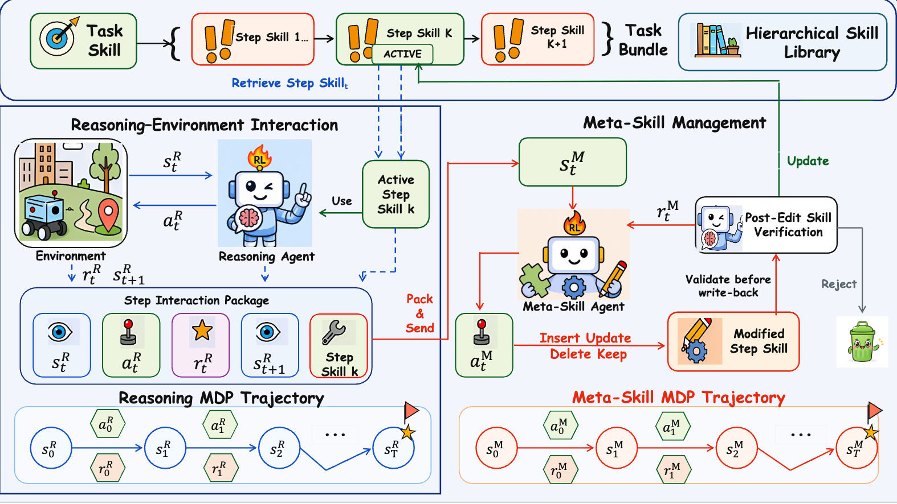
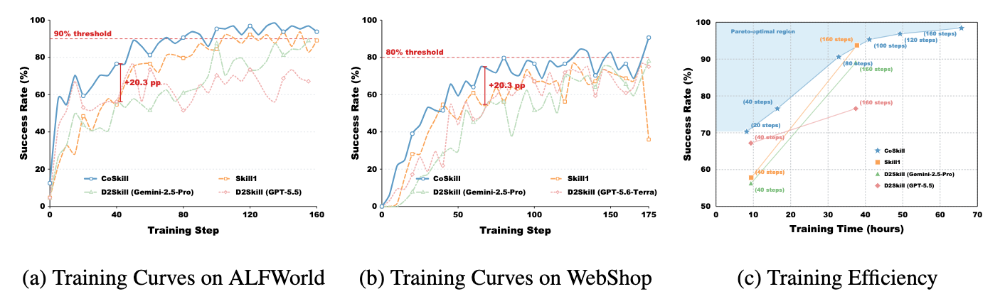

# CoSkill: Joint Reinforcement Learning of Reasoning and Meta-Skill Agents for Hierarchical Skill Evolution

CoSkill trains a Reasoning Agent and a Skill Agent with a hierarchical Skill
Bank. The current release supports ALFWorld and WebShop. Environment setup
follows the organization used by
[`verl-agent`](https://github.com/langfengQ/verl-agent#install-supported-environments),
and separate Python or Conda environments are recommended for the two tasks.

## Overview



## Experimental Results



## 1. Hierarchical Skill Banks

`initial_skill_bank` collects task skills and their linked step skills. The
repository includes pre-collected Skill Banks that are loaded by default:

| Environment | Task skills | Step skills | Skill Bank |
| --- | ---: | ---: | --- |
| ALFWorld | 300 | 1,625 | [`alfworld_gpt-5.5-2026-04-24_300.json`](initial_skill_bank/skill_bank/alfworld_gpt-5.5-2026-04-24_300.json) |
| WebShop | 300 | 1,406 | [`webshop_gpt-5.5-2026-04-24_300.json`](initial_skill_bank/skill_bank/webshop_gpt-5.5-2026-04-24_300.json) |

To collect a new Skill Bank, copy the environment template, configure the API
settings, and run the launcher for the target environment:

```bash
cp env.example env.sh
# Set the API URL, key, and model in env.sh.

./initial_skill_bank/run_generate_alfworld_initial_skill_bank.sh
./initial_skill_bank/run_generate_webshop_initial_skill_bank.sh
```

See [`initial_skill_bank/README.md`](initial_skill_bank/README.md) for collection
options. Set `INITIAL_SKILL_BANK_PATH=/path/to/skill_bank.json` to train with a
different Skill Bank.

## 2. Environment Setup

### Common dependencies

```bash
cd /path/to/CoSkill
python -m pip install -r requirements.txt
python -m pip install --upgrade --force-reinstall fastapi
python -m pip install sentence-transformers==5.2.0
```

### ALFWorld

```bash
python -m pip install \
  alfworld \
  gymnasium==0.29.1 \
  stable-baselines3==2.6.0

# Download and validate the official ALFWorld data when needed.
alfworld-download -f
alfworld-play-tw
```

Set `ALFWORLD_DATA` in `env.sh` to the downloaded ALFWorld data directory.

### WebShop

WebShop should use a separate environment with Python 3.10 or earlier:

```bash
python -m pip install \
  gymnasium==0.29.1 \
  stable-baselines3==2.6.0 \
  beautifulsoup4==4.11.1 \
  cleantext==1.1.4 \
  gym==0.24.0 \
  pyserini==0.17.0 \
  rank_bm25==0.2.2 \
  selenium==4.2.0 \
  Flask==2.1.2 \
  Werkzeug==2.1.0 \
  thefuzz==0.19.0

python -m pip uninstall -y apex
chmod +x webshop.sh
./webshop.sh

export JAVA_HOME="$(python -c 'from jdk4py import JAVA_HOME; print(JAVA_HOME)')"
export PATH="$JAVA_HOME/bin:$PATH"
```

## 3. Run Training

Copy `env.example` to `env.sh` and replace all model and dataset placeholders
before training. The launchers load this file automatically.

Start the shared skill-retrieval service in terminal 1:

```bash
PORT=8003 bash examples_coskill/skill_retrieval_launch.sh
```

Run one training environment in terminal 2:

```bash
# ALFWorld
bash examples_coskill/run_alfworld_coskill.sh

# WebShop
bash examples_coskill/run_webshop_coskill.sh
```

Model, dataset, embedding model, and output paths can be overridden with
environment variables. Run either training launcher with `--help` to inspect
its main settings.

## Acknowledgements

CoSkill was developed with reference to the following open-source projects:

- [VERL](https://github.com/verl-project/verl)
- [verl-agent](https://github.com/langfengQ/verl-agent)
- [LaMer](https://github.com/mlbio-epfl/LaMer)
- [D2Skill-AgenticRL](https://github.com/TU2021/D2Skill-AgenticRL)

We thank their authors and contributors for making their work publicly
available.

## 4. Architecture and Training Flow

CoSkill separates task execution from skill evolution while allowing both roles
to share the same actor model:

```text
Skill Bank -> embedding retrieval -> Reasoning Agent -> environment
                                      |
                                      v
                                Skill Agent edit
                                      |
                         private overlay + meta-attempts
                                      |
                                      v
                    validated bundle promotion / rejection
```

- At reset, CoSkill retrieves task-level skills; in `task_step` mode, each
  subsequent observation retrieves step skills only from the selected task
  skill's children.
- The Skill Agent proposes `INSERT`, `UPDATE`, `DELETE`, or `KEEP` decisions.
  Edits are first applied to a trajectory-private overlay and evaluated on the
  same task in later attempts, leaving the global Skill Bank unchanged during
  verification.
- GiGPO combines episode-level and step-level relative advantages. The
  Reasoning Agent uses environment returns, while the Skill Agent receives the
  improvement of edited attempts over the baseline as a sparse reward. The two
  batches are then interleaved for one shared PPO actor update.
- Validated edits are promoted as new, lineage-tracked task bundles. Utility
  statistics, optional UCB ranking, and frequency/recency eviction manage the
  Skill Bank over the course of training.

## 5. Repository Structure

| Path | Purpose |
| --- | --- |
| [`agent_system/memory`](agent_system/memory) | Hierarchical Skill Bank, embedding retrieval, overlays, and lifecycle management |
| [`agent_system/multi_turn_rollout`](agent_system/multi_turn_rollout) | Environment interaction, Skill Agent editing, and multi-attempt rollout collection |
| [`gigpo`](gigpo) | GiGPO step-return and advantage computation |
| [`verl/trainer/ppo`](verl/trainer/ppo) | VERL PPO trainer integration and joint actor updates |
| [`examples_coskill`](examples_coskill) | Training launchers and the FastAPI skill-retrieval service |
| [`initial_skill_bank`](initial_skill_bank) | Offline ALFWorld/WebShop skill-bank generation pipelines |

## 6. Configuration Notes

- Keep `actor_rollout_ref.rollout.n=1`; rollout grouping is controlled by
  `env.rollout.n` in the environment manager.
- Meta-attempt training requires embedding retrieval, `task_step` mode,
  `top_k_task=1`, a local embedding model for private overlays, and at least
  two attempts.
- Validation reuses the current training Skill Bank and always evaluates with
  skills enabled. Promotion, eviction, and retrieval snapshots are persisted
  under the configured trainer output directory for audit and resume.
